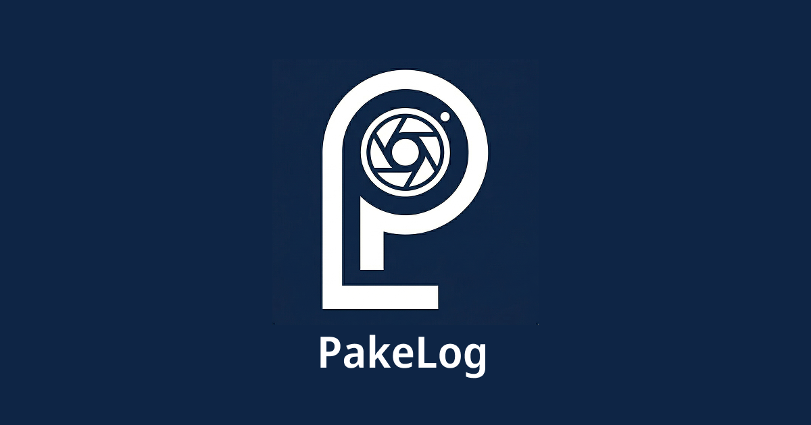
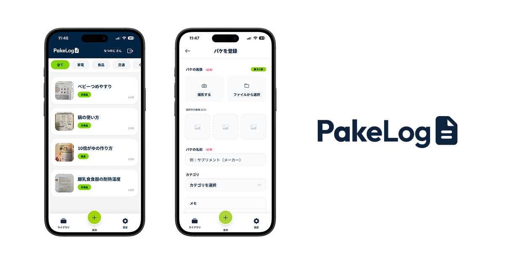

## 1. サービス概要
### PakeLog（パケログ）　: https://pake-log.onrender.com/
- **「捨てても困らない」を作る、家族のためのパッケージ＆説明書ログ。**
- スマホのアルバムを汚さず、厚紙の説明書やバスの時刻表を秒速で取り出すための「デジタル保管庫」です。
- 物理的な管理コストをゼロにし、必要な情報へ1秒でアクセスできる体験を提供します。

  
  
<em>パケログのコンセプト</em>

  
  
<em>パケログ操作画面</em>

---

## 2. このアイデアはどこから生まれたか
### 2-1. きっかけとなった体験・感情
【体験面】
新しい家電や調理器具を買った際、パッケージの裏面や厚紙1枚の簡易説明書を「念のため」とスマホで撮影していました。しかし、数ヶ月後にいざ確認しようとすると、数千枚の「思い出の写真（子供や食事）」の中に埋もれてしまい、結局見つけられずにネットで検索し直すという無駄な時間を何度も繰り返していました。

【感情面】
「せっかく撮ったのに見つからない」という自分への苛立ちと、物理的に保管しておくと場所を取り、捨てると不安になるという「情報の板挟み」にストレスを感じていました。また、大切な思い出の写真に、無機質な「説明書の写真」が混ざっている状態が、自分のデジタル空間を汚されているようで非常に不快でした。

### 2-2. なぜそれが「気になった」のか
私は「思い出」と「記録」を明確に分離し、整理された状態を好む性格だからです。情報の定位置が決まっていないことで発生する「探しもの」という非生産的な時間を極限まで減らしたいという価値観を持っています。また、スマホを単なるカメラではなく「自分専用のデータベース」として最適化したいという欲求が強いため、この課題が気になりました。

## 3. 課題の整理
### 3-1. 表に見えている困りごと
- 物理的な説明書がバラバラのサイズで保管しづらく、パッケージから剥がすと剥がし跡で汚い状態になってしまう。
- スマホのカメラロールで画像を探すのが非常に面倒。
- たまに通院で使うバスの時刻表など、Googleマップで検索するほどでもない「ちょっとした情報」へのアクセスが遅い。

### 3-2. 本当に解決したい課題は何か
- 「一時的な確認のために必要な情報」が日常に埋もれてしまう事象を解消し、脳のメモリを使わずに「あそこに行けば必ずある」という安心感（情報の保管場所の確立）を提供すること。

## 4. 想定ユーザーについて
### 4-1. 想定しているユーザー
年齢設定：
- 年齢：20-40代
- 理由：デジタルネイティブであり、スマートフォンの利便性を理解している一方、ライフステージの変化（一人暮らし・結婚・出産・マイホーム購入等）により、管理すべきアイテムや書類が急増する世代であるため。

生活・状況：
- 子育てや仕事で忙しく、探しものに時間をかけたくない。
- キッチン周りやガジェット類が多く、細かい使用ルールを確認する頻度が高い。

環境：
- ペーパーレス化を推進したいが、完全に捨て去る勇気が出ない「中途半端なアナログ情報」に囲まれている環境。

### 4-2. 自分とユーザーの距離
自分自身：まさに今、目の前で直面している課題であり、自分自身が「一番の熱烈なユーザー」になれる自信があるため。

### 4-3. 実際に使われる可能性について
まず最初に使ってくれそうな人は誰か？
- 新生活を始めたばかりの人や、新しい家電・育児グッズを購入した直後の人。

その人は、どんな場面でこのアプリを思い出すか？
- 購入した商品の箱をゴミ箱に捨てる瞬間。

今の生活の中で、代わりに使っているものは何か？
- 標準の「写真」アプリ、またはNotionだったりLINEの自分専用グループ。

それを置き換えてまで使う理由はあるか？
- 「カメラロールが汚れない」「1画面で最大3枚をサッと見られる」「検索が速い」という専用WEBアプリならではの特化体験があるため。

### 4-4. ユーザーがサービスを導入して利用するまでのイメージ
きっかけ
- 「説明書 整理 アプリ」などの検索や、アルバムの整理に疲弊したタイミング。

最初の一歩
- 手近にある「よく使うけど捨てられない説明書」を1つ撮影し、タイトルを付けて保存する。

利用を続ける理由
- 2回目、3回目と「あ、あの説明書パケログで見よう」と成功体験を繰り返すことで、生活のインフラとして定着する。

## 5. 既存サービス・競合調査
### 5-1. 似たサービスの調査
サービス名：トリセツ
URL： https://torisetsu.biz/

できること
- 型番を入力すると、メーカー公式のPDF説明書を自動で紐付けて管理できる。

パケログとの違い
- 「トリセツ」は大手メーカーの製品（家電など）が主。パケログは「バスの時刻表」「地元企業のパンフレット」「離乳食の成分表」など、**ネットに落ちていない自分だけのパッケージ・アナログ情報を自ら撮影して管理する**ことに特化している。

### 5-2. それでも自分が作りたい理由
既存サービスは「公式データがあるもの」には強いですが、私が困っている「厚紙1枚のレシピ」や「地域の時刻表」には対応していません。また、標準の写真アプリでは「思い出」と混ざる不快感が解消されません。「自分の手で撮ったものを、そのまま綺麗に、思い出とは別枠で隔離したい」という欲求を満たすサービスはまだ存在しないと感じています。

### 5-3. 差別化を一文で決める
私のアプリの差別化ポイント： 「公式説明書」ではなく、ユーザーが日常で遭遇する「捨てづらい紙片やパッケージ」を、思い出を汚さずに高速ストックできるデジタル保管庫。

## 6. このサービスで提供したい価値
### 6-1. ユーザーの変化
行動の変化
- 説明書を撮影した後、迷わず現物を捨てられるようになる。

気持ちの変化
- 探しものに対する不安が消え、**パケログにあるから大丈夫**という心の余裕が生まれる。

考え方の変化
- スマホのアルバムを、純粋な「思い出の場所」として利用し、パケログは記録の保管庫であるという使い道の切り分けが可能になる。

### 6-2. 価値を一文で表す
- **「パケログは、モノを減らしたい人が、スマホのアルバムを汚さず、必要な情報へ瞬時に辿り着けるようになるサービス」**

## 7. このアプリで実現すること
MVPで作る機能
- **ユーザー認証 (LINEログイン):** モバイルからの登録・ログインの摩擦を最小化。
- **プリセット・カテゴリ:** 「家電」「食品・成分」「交通・時刻表」「くすり」「日用品」「その他」の6種を用意
- **アイテム投稿**：タイトル、メモ、カテゴリ選択、画像最大3枚
- **画像のリサイズ・圧縮保存**：文字が読める範囲での軽量化
- **レスポンシブ対応**：スマホのみの利用を想定
- **画像拡大表示ビューワー**：細かい時刻表や成分表をピンチ操作で確認
- **一覧のカテゴリ検索・キーワード検索**：タイトルやカテゴリからの絞り込み

本リリース（追加実装）で追加した機能
- **カスタムカテゴリ:** デフォルトのカテゴリに加え、ユーザーがカスタマイズできるカテゴリを実装。
- **お気に入り機能:** カテゴリ分類と別軸でお気に入りを記録しておけるため

## 8. このアプリの懸念点とその対策
懸念点①：**セキュリティと責任の範囲**
- 何が問題か： パスワードやマイナンバーを誤って保存され、流出した際の責任問題。
- 対策： 投稿画面に「機密情報の入力禁止」を明示する警告を表示。利用規約に免責事項を記載し、あくまでプロトタイプであることを強調。

懸念点②：**ストレージコスト**
- 何が問題か： iPhoneの高画質写真が蓄積され、無料枠のサーバー容量を圧迫する。
- 対策： Cloudinary等を使用し、アップロード時に自動でリサイズ（横幅1200px程度）と品質圧縮を行い、可読性と軽量化を両立させる想定。

## 9. 今後の展開・発展の方向性
家族間共有
- 家族と時刻表を共有することで、家全体の「あれどこ？」を削減。

データ蓄積
- ユーザーが「何を捨て、何を保存したか」の統計が取れれば、将来的に「みんなが捨てて後悔しなかったものリスト」などのレコメンドが可能に。

## 10. 技術スタック
### 10-1. 使用技術一覧
| カテゴリ | 選定技術 | 役割 |
| :--- | :--- | :--- |
| **Backend** |  | 開発効率の高さ。MVCモデルにより複雑なロジックを整理しやすいため |
| **Frontend** |   | スマホ優先のUIを迅速に構築し、JSの状態管理により高度な画像操作UIを実現するため |
| **DB** |  | 家族、投稿など、将来的なリレーション拡張に強いため |
| **Storage** |  | 自動リサイズ・圧縮機能が強力。無料枠内で「読めるけど軽い」を実現するため |
| **Infrastructure** |  | 継続的なデプロイが可能で、個人開発の運用コストを最適化できるため |

### 10-2. 技術選定の理由
1. **Cloudinaryの採用理由:** iPhone等で撮影した写真は1枚数MBに及びますが、これをそのまま扱うと無料枠のストレージがすぐにリミットに達してしまいます。本アプリでは Cloudinary の変換パラメータ（`width: 500, crop: :limit`）を活用し、**「文字の可読性を維持しつつ、表示サイズに合わせて画像を最適化」**することで、データ転送量とストレージ容量を大幅に削減し、無料枠内での永続的な運用を可能にしています。
2. **Tailwind CSSの採用理由:** 片手でスマホ操作をするシーンが多いため、ボタンサイズや配置を柔軟に微調整する必要があるため。
3. **Stimulus JS による画像管理:** 「1枚消すとプレビューが全て消える」という課題に対し、JSの状態管理による再描画ロジックを導入。既存と新規画像を配列で一元管理し、直感的な編集UXを実現しました。
4. **トランザクションによる整合性:** 画像の物理削除とDB更新をトランザクション化し、不測のエラー時にもデータの整合性が保たれる堅牢な設計を行いました。

### 11.画面遷移図
Figma：<https://www.figma.com/design/aw0k9A9gx5GBcN2zVT66NZ/%E5%8D%92%E6%A5%AD%E5%88%B6%E4%BD%9C_%E3%81%AA%E3%81%A4%E3%81%AE%E3%81%98?node-id=10-1424&t=US1K8tJ48gulv2an-1>

### 12.ER図

### 参考資料
PRD：<https://docs.google.com/document/d/11QHxyRknSRpW0Zmnqm6qwUHoi_BEPXWFMw91l6sbV18/edit?tab=t.gtiq9ypbitum#heading=h.br1xudy1p4ns>
